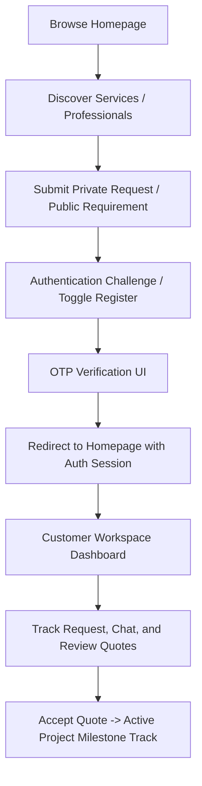

# Customer Journey Flow

This document maps the customer interaction stages on the DBC platform.

## Key Highlights
* **Login Redirection:** On successful authentication, the customer lands back on the public homepage (`/`) with their session active so they can continue browsing.
* **Workspace Access:** Customers enter their workspace by clicking "Dashboard" (`/workspace/overview`) in the navbar.
