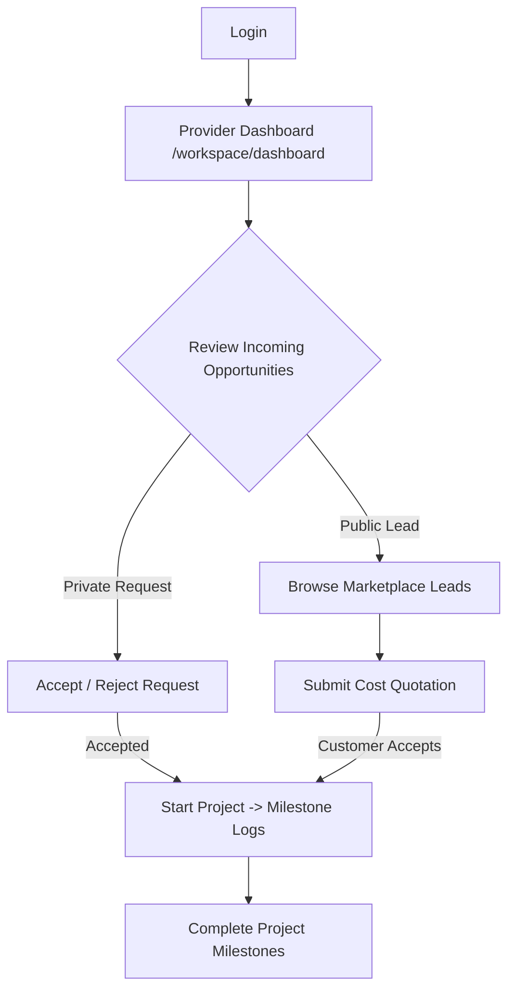

# Professional/Contractor Workspace Flow

This document maps the workflow of a registered trade professional.

## Action Center
* **Accept / Reject:** Can only transition direct requests when status is `REQUESTED`.
* **Start / Complete:** Professional updates project execution status directly.
