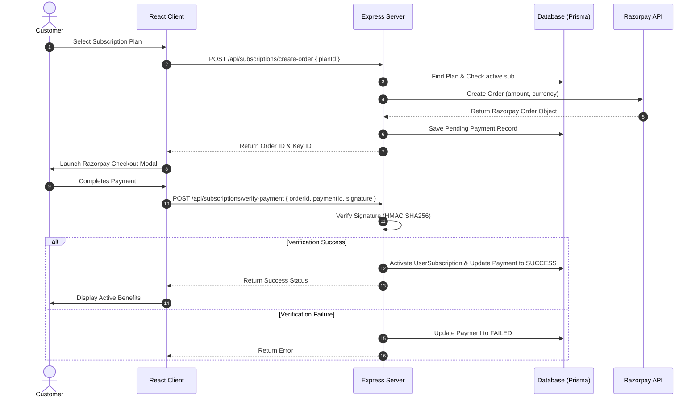

# Subscription Payment Flow

This sequence diagram outlines how Razorpay subscriptions are processed.

```mermaid
sequenceDiagram
  autonumber
  actor Customer
  participant Client as React Client
  participant Server as Express Server
  participant DB as Database (Prisma)
  participant RZP as Razorpay API

  Customer->>Client: Select Subscription Plan
  Client->>Server: POST /api/subscriptions/create-order { planId }
  Server->>DB: Find Plan & Check active sub
  Server->>RZP: Create Order (amount, currency)
  RZP-->>Server: Return Razorpay Order Object
  Server->>DB: Save Pending Payment Record
  Server-->>Client: Return Order ID & Key ID
  Client->>Customer: Launch Razorpay Checkout Modal
  Customer->>Client: Completes Payment
  Client->>Server: POST /api/subscriptions/verify-payment { orderId, paymentId, signature }
  Server->>Server: Verify Signature (HMAC SHA256)
  alt Verification Success
    Server->>DB: Activate UserSubscription & Update Payment to SUCCESS
    Server-->>Client: Return Success Status
    Client->>Customer: Display Active Benefits
  else Verification Failure
    Server->>DB: Update Payment to FAILED
    Server-->>Client: Return Error
  end
```
